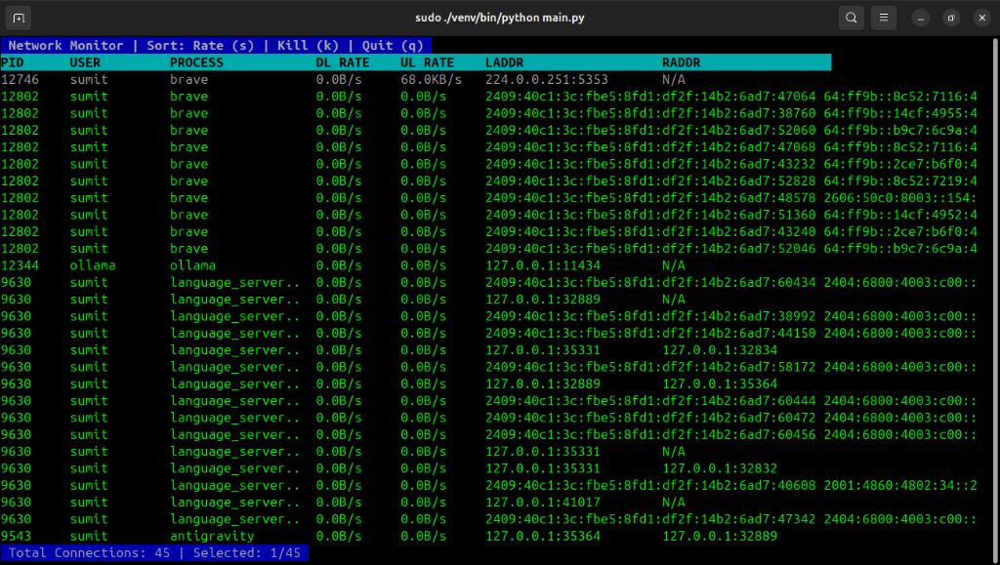

# Network Monitor CLI

A lightweight, interactive command-line tool for monitoring network usage per process on Linux. Built with Python and `curses`, it provides real-time insights into active connections, bandwidth usage, and allows for process management directly from the terminal.



## Features

*   **Real-time Monitoring**: Updates network connections and status every second.
*   **Per-Process Bandwidth**: Estimates Download and Upload rates (KB/s, MB/s) based on process I/O.
*   **Interactive UI**:
    *   **Navigation**: Navigate rows using Up/Down arrow keys.
    *   **Sorting**: Cycle through sorting modes (Rate, PID, Name) by pressing `s`.
    *   **Process Control**: Terminate (kill) selected processes directly by pressing `k`.
*   **Detailed Info**: Displays PID, User, Process Name, Local/Remote Addresses, and connection status.
*   **Lightweight**: Minimal dependencies (only `psutil`).

## Prerequisites

*   **OS**: Linux (Ubuntu/Debian recommended)
*   **Python**: 3.6 or higher
*   **Permissions**: Root/Sudo privileges are required to view system-wide processes and bandwidth stats.

## Installation

1.  **Clone the repository:**
    ```bash
    git clone https://github.com/yourusername/network-monitor.git
    cd network-monitor
    ```

2.  **Set up a virtual environment (recommended):**
    ```bash
    python3 -m venv venv
    source venv/bin/activate
    ```

3.  **Install dependencies:**
    ```bash
    pip install -r requirements.txt
    ```

## Usage

To run the tool, use `sudo` to ensure it can access all process information:

```bash
sudo ./venv/bin/python main.py
```

> **Note**: If you are not using a virtual environment, you can run `sudo python3 main.py`.

### Key Bindings

| Key | Action |
| :--- | :--- |
| `Up` / `Down` | Navigate the process list |
| `s` | Cycle sorting mode (Rate -> PID -> Name) |
| `k` | Kill the currently selected process (requires confirmation) |
| `q` | Quit the application |

## Troubleshooting

**"Permission Denied" or missing processes:**
Most operating systems restrict access to network statistics of other users' processes. Run the tool with `sudo` to see all connections.

**"sudo: python: command not found":**
When using `sudo` with a virtual environment, you must specify the full path to the python executable within the venv, or use the command shown in the Usage section (`sudo ./venv/bin/python ...`).

## License

This project is licensed under the MIT License. See the [LICENSE](LICENSE) file for details.
